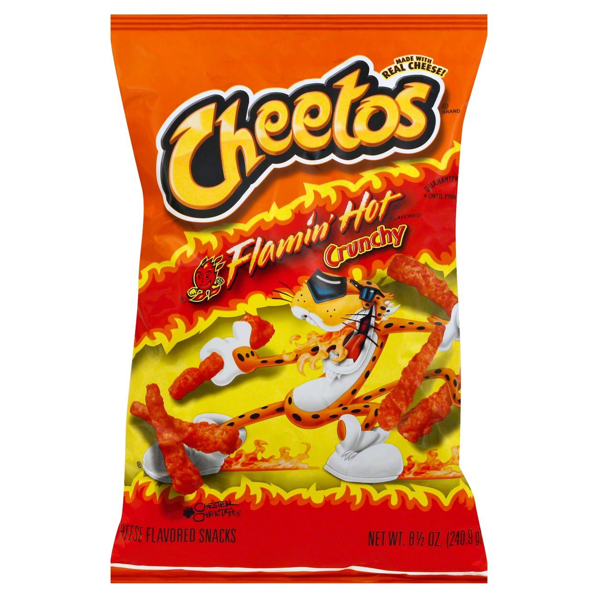

<!DOCTYPE html>
<html lang="en">
  <head>
    <title>Cheetos</title>
    <meta charset="utf-8" />
  </head>
  <body>
    <h1>Cheetos</h1>
    <section>
      <figure>
        
      </figure>
    </section>
  </body>
</html>
